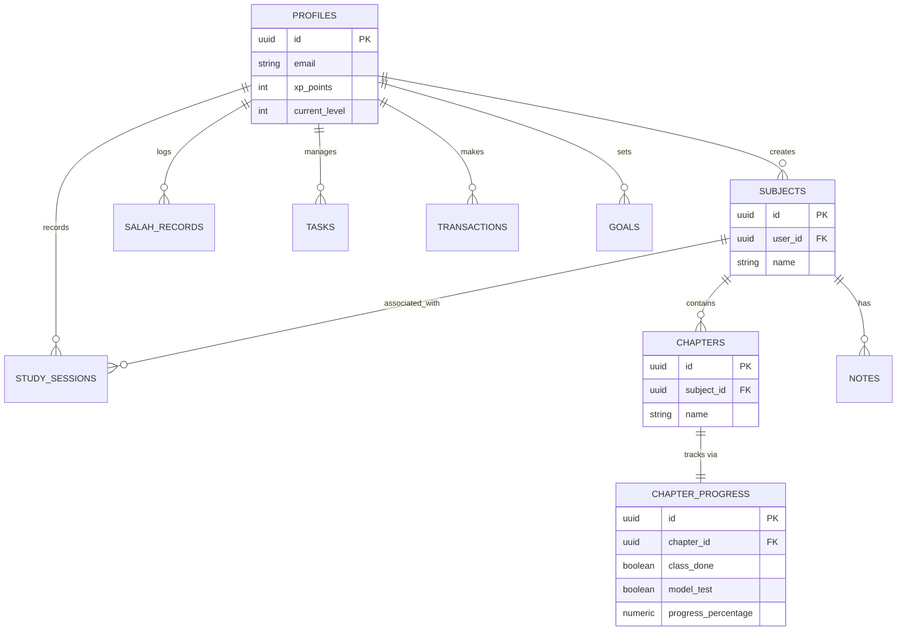

# Personal Life OS - Entity Relationship Diagram

The database follows a distinct Star Schema pattern centered on the `PROFILES` table, mapping 1:1 to Supabase Auth (`auth.users`).

- **Aggregations**: `CHAPTER_PROGRESS` is automatically generated continuously through a defined `GENERATED ALWAYS AS` computed column to save complex client-side calculations and prevent drift.
- **Security**: Because all tables maintain a direct `user_id` Foreign Key to `PROFILES`, Supabase RLS is simply defined as `USING (auth.uid() = user_id)` across the board.
